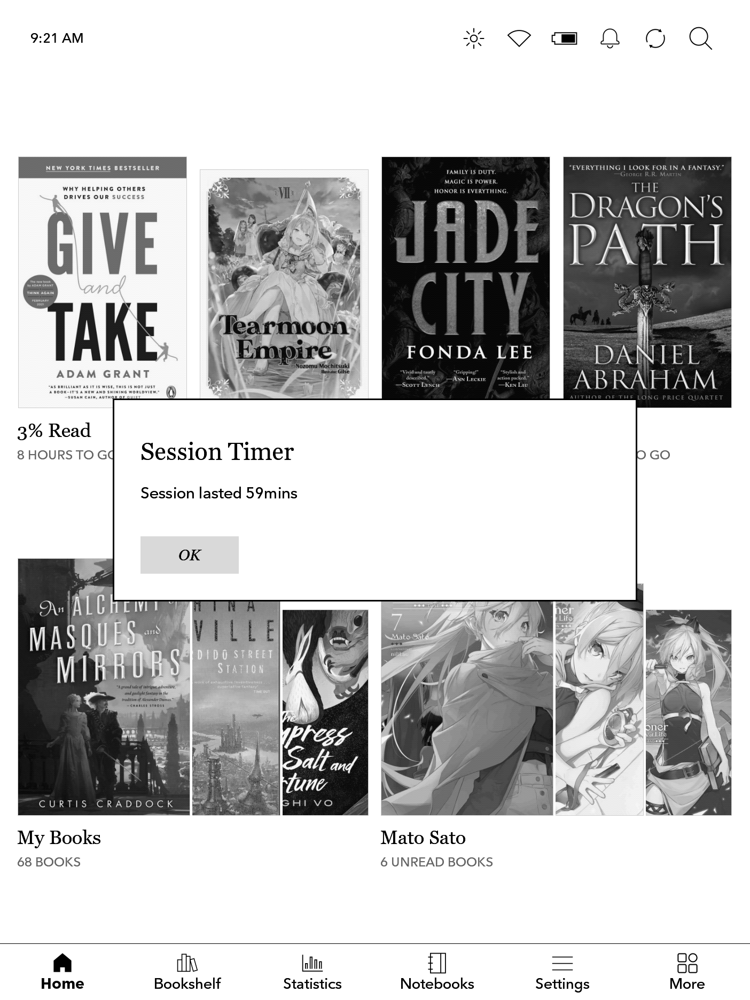

# nm-session-timer
A script as part of NickelMenu to track session time

copy the session_timer folder to ./adds/

add to Nickel config
```
menu_item   :main :Toggle Timer    :cmd_output :500  :exec /mnt/onboard/.adds/session_timer/session_toggle.sh
```

or if you want to separate session start and stop:
```
menu_item   :reader :Start Timer    :cmd_output :500  :exec /mnt/onboard/.adds/session_timer/session_start.sh
menu_item   :reader :End Timer    :cmd_output :500  :exec /mnt/onboard/.adds/session_timer/session_end.sh
```



